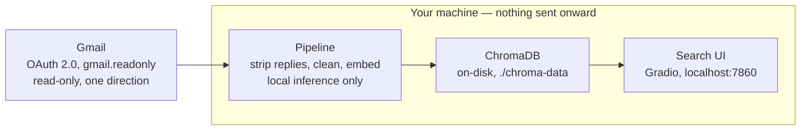

# Gmail RAG evidence pack — design

Status: approved design, pre-implementation.
Base commit: `d041aa1` ("Add query writing guide with example queries to README").
Origin: a portfolio-strategy review found that `2-emailai.md` describes architecture but proves no outcomes — no retrieval benchmark, no latency numbers, no failure analysis, no security check.
This spec scopes the work that closes that gap, against the review's four-layer standard: model quality → system quality → user outcome → business/operational outcome.

## Ground-truth check against the code

The recovered code at `d041aa1` does not match what the live portfolio page (`2-emailai.md`) currently describes.
`pipeline.py` embeds each whole email as a single document.
There is no chunking, no `RecursiveCharacterTextSplitter`, no LangChain `Runnable` pipeline, and no LLM generation step anywhere in this commit.
Commit `f16023e` in this repo's own history is titled "Embed whole emails; skip reply chain messages" — confirming this is the real, intended architecture at this point, not an oversight.
The portfolio page's chunking/LangChain description belongs to the later Agentic Process Discovery evolution, not this project.
Correcting that description is in scope for the eventual rewrite (item F below), not a separate follow-up.

## Where this work lives

The eval harness and its results are themselves portfolio evidence.
They belong in this repo, as commits on top of `d041aa1`, not as a side script elsewhere.

```
eval/
  synthetic_corpus/     # ~150 constructed emails + ground-truth labels, public
  benchmark.py           # retrieval eval: semantic (this pipeline) vs. BM25
  latency.py             # ingestion + query timing
  failures.md             # failure/error analysis writeup
  security_review.md      # security check writeup
  results/                 # raw + summarized metric output, committed as evidence
  README.md                 # entry point tying the four items together
```

## A. Retrieval benchmark

Two eval runs, same metrics, different corpora:

- **Synthetic (public).** ~150 constructed emails spanning the categories this tool targets — events, deadlines, newsletters, receipts, reply threads (to exercise reply-stripping). Hand-authored queries with known-relevant-document labels. Checked into the repo in full.
- **Real (private).** Your actual inbox, run through the existing pipeline. ~20-30 queries, hand-labeled for relevance by you. Only aggregate metrics are published — a results table. Raw content, subjects, and senders are never published.

Metrics: Precision@k, Recall@k, and MRR, computed identically for semantic search (this pipeline) and a BM25 baseline (`rank-bm25`) over the same corpus and queries, reported side by side.
BM25 was chosen over naive keyword substring match because it's the standard, industry-recognized IR baseline — semantic search needs to beat a real competitor, not a strawman.

## B. Latency & cost

`eval/latency.py` measures three things directly, no proxies:

- Ingestion throughput — emails/sec, wall-clock for N=50 and N=200.
- Per-query latency — p50/p95 over the full benchmark query set.
- Cost — stated explicitly as $0 marginal, since embedding runs locally with no external API calls. That absence of a cost line is itself a real, reportable number, not a placeholder.

## C. Failure analysis

Pull the lowest-scoring queries from both benchmark corpora and inspect them manually.
The expected finding is the whole-email-embedding tradeoff: long emails compress to one vector, so a query targeting one sub-topic inside a long email likely underperforms.
That's a genuine, honest limitation worth documenting on its own terms — and it's also exactly what motivated the later shift to chunking in the APD evolution, so it connects the two projects' histories truthfully instead of retroactively describing this one as already having solved it.
`eval/failures.md` documents actual cases: query, expected result, what came back instead, root cause.

## D. Security check

Three concrete checks, grounded in the actual code, not a generic checklist:

1. **OAuth scope audit.** Confirm `SCOPES` in `config.py` is `gmail.readonly` and stays that way.
2. **At-rest review.** ChromaDB stores raw email text unencrypted on local disk (`./chroma-data`). State this plainly as a known, accepted tradeoff for a local-only single-user tool, not something to gloss over.
3. **Output-injection check.** `app.py` renders retrieved email snippets directly into `gr.Markdown` with no visible sanitization step. Test whether an email body containing Markdown or HTML (``, links, etc.) can inject into the rendered UI. This is the applicable security angle at this commit — there is no LLM generation step, so classic prompt-injection-into-generation does not apply here; it's a UI/content-injection surface instead.

## E. Onboarding — one command, minimal effort

**New backlog item, elevated to first-class scope alongside A-D.**
Constraint: trying this tool must take at most one command from the user's side.
Wall-clock setup time can be several minutes — that's acceptable — but the *effort* the user has to supply must be minimal: one command initiates everything, with no manual multi-step CLI sequence required to get from a cold clone to a working query.

This was validated against the actual repo, not assumed.
Walking `README.md` and both setup scripts start to finish, on a machine that has never touched this repo or the Gmail API, comes to roughly 10-20 minutes today, and two concrete bugs surfaced along the way:

- `setup.sh`'s venv-creation and dependency-install steps (lines 13-32) are commented out. The script currently only starts ChromaDB and checks for credentials — "automated setup" is not actually automated right now.
- `README.md` documents `N_EMAILS` as defaulting to 50. `config.py` actually defaults it to 500. These need to agree.

Both fixes are in scope for this item, not separate cleanup.

Two deliverables:

- **`demo.sh`** — a zero-setup path for anyone just evaluating the tool. No Gmail account or OAuth app required. Installs dependencies if missing, ingests the `eval/synthetic_corpus/` set (reusing item A's corpus rather than building a second one), and launches the UI pre-loaded. Target: under a minute with a warm dependency cache, a couple of minutes cold.
- **Fixed `setup.sh` + `run.sh`** — for someone pointing the tool at their own inbox. The one-time Gmail OAuth app creation in Google Cloud Console cannot be automated away; it's gated by Google's own console, not this codebase. Everything after that collapses to two commands: `setup.sh` (venv, dependency install, credential check — actually executing the code that already exists but is currently disabled) and `run.sh` (start ChromaDB, auto-ingest if the collection is empty, launch the UI).

## Demonstrations (reference)

Built and reviewed as an artifact before this spec was written: https://claude.ai/code/artifact/60114aec-b6d7-4927-b4c8-794d95aaef44

Reproduced here so the spec is self-contained.

### The search, mocked

Illustrative only — placeholder emails, not real inbox content or a real benchmark run.

Query: `an email about an upcoming deadline or submission cutoff`

| Score | Subject | From | Date |
|---|---|---|---|
| 0.81 | Re: Grant renewal — documents due Friday | research-office@university.edu | Aug 14 |
| 0.77 | Your submission window closes soon | no-reply@conference-system.org | Aug 09 |
| 0.69 | Landlord — lease renewal paperwork | j.turner@property-mgmt.com | Jul 30 |

### How it touches the inbox



### Time to first query, today

| Step | Time (est.) | Note |
|---|---|---|
| Create Gmail OAuth app | ~5-10 min | Google Cloud Console. The real bottleneck — can't be scripted away. |
| Clone + install dependencies | ~2-5 min | Currently manual — `setup.sh`'s install steps are commented out. |
| First-run model download | ~1-3 min | BGE-base-en-v1.5 weights from Hugging Face, cached after. |
| Gmail consent screen | ~30 sec | `token.json` caches it after the first run. |
| Ingest emails | not yet measured | Real duration is exactly what item B's latency harness measures. README says N_EMAILS defaults to 50; config.py defaults to 500 — mismatch to fix. |
| Launch UI, first query | instant | `run.sh` starts ChromaDB if needed and launches the Gradio app. |

**Total, estimated: ~10-20 minutes cold**, dominated by the OAuth app step (unavoidable) and the dependency install (currently manual, fixable).

### Proposed one-command flow

Try it now, no inbox required:

```
$ ./demo.sh
[demo] venv ready, dependencies cached
[demo] starting ChromaDB…
[demo] loading synthetic inbox (150 emails)…
[demo] ready → http://127.0.0.1:7860
                                          < 1 min warm cache, ~2 min cold
```

Use it on your own inbox:

```
  (one-time, manual: create Gmail OAuth client in Google Cloud Console)

$ ./setup.sh
[setup] venv ready, dependencies installed
[setup] Gmail credentials found
$ ./run.sh
[run] ChromaDB started
[run] no existing collection — ingesting inbox…
[run] Launching UI → http://127.0.0.1:7860
```

## F. Feeds the portfolio rewrite

Once `eval/results/`, `eval/failures.md`, `eval/security_review.md`, and the onboarding fixes exist, `2-emailai.md` gets rewritten following the same structure already used for the MSEval and MIA portfolio pages: problem → what was built → what it shows → key design decisions.
The architecture section is corrected to describe the real `d041aa1` pipeline (whole-email embedding, no chunking, no LLM step) rather than the APD-era description currently there.
The rewrite cites the benchmark, latency, failure, and security numbers directly, and states the one-command try-it path as part of "what was built," not as a footnote.

## Scope check

Checked against `context/goals.md`'s Portfolio Build Filter (career-ops repo): clears 5 of 6.
Strengthens the AI-evaluation/privacy lane, produces metrics beyond accuracy (latency, cost, reliability), exposes a real constraint (personal-data privacy forcing the hybrid eval design), is showable publicly via the synthetic set, and is inspectable in the repo in under five minutes.
Item 6 (external contributors) is plausible but not guaranteed — not required, since only 5 of 6 is the bar.
